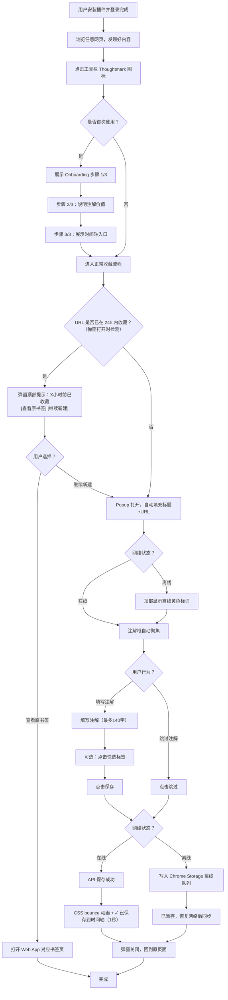
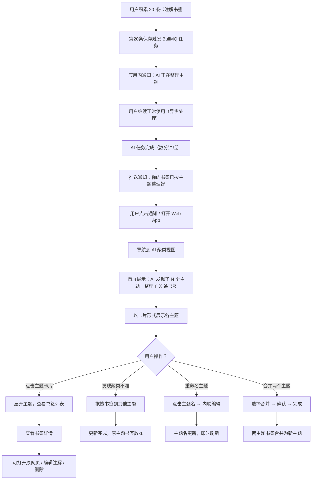
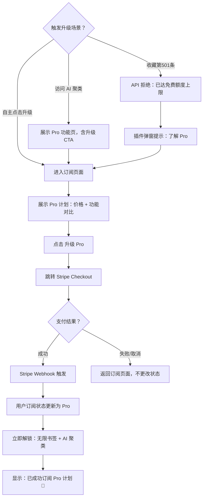

# UX Design Specification Thoughtmark

**Author:** A-pc
**Date:** 2026-03-20

---

## Executive Summary

### Project Vision

Thoughtmark 帮助知识工作者把"为什么收藏"这个动作留下来，通过 AI 聚类把分散的书签转化成可回顾的"思维地图"。核心差异不是收藏本身，而是**带注解的知识沉淀**——让用户在未来的某一天能理解当时的自己为什么感兴趣这个内容。

### Target Users

**Sara（27 岁，产品经理）**：每天收藏大量内容，但之后再也找不回上下文，痛点是"收藏夹成坟墓"。她需要一个在收藏时能留住"为什么"的工具，而不是又一个书签整理器。

**James（34 岁，独立开发者）**：自我驱动学习，需要把碎片化技术资料结构化。他会主动产出内容，需要看到自己的知识是否在"成长"——聚类结果对他来说是一面镜子。

**两个核心使用场景**：
- **当下情境（插件）**：浏览中遇到好内容 → 一键保存 → 写一句"为什么"
- **回顾情境（Web App）**：定期整理 → 看时间轴 → 发现 AI 已归纳主题

### Key Design Challenges

1. **摩擦力控制**：插件弹窗必须 < 3 秒完成收藏。注解是核心差异点，但不能强制。"写注解"用户和"跳过"用户都要服务，且两种路径都需要流畅
2. **空状态体验**：新用户收藏 < 20 条时，时间轴空、AI 未触发，是最高流失风险窗口，需要进度感知设计
3. **AI 可信度建立**：聚类结果首次展示时用户会怀疑准确性，可调整性（合并/拆分/重命名）是建立信任的唯一路径
4. **跨设备身份连续性**：插件（Chrome）和 Web App 是两个不同入口，必须让用户感受到"这是同一个地方"

### Design Opportunities

| 机会 | 预期效果 |
|---|---|
| 注解占位符文案："为什么要看这个？" | 引导文案比空白框显著提升注解填写率 |
| 时间轴相对时间 + 日期分组（今天/本周/更早）| 带来日记式沉浸感，强化"思维轨迹"价值 |
| AI 聚类首屏："AI 整理了你 X 条书签，发现了 Y 个主题" | 具体数字量化 AI 价值感知 |
| 离线状态显示："已暂存 X 条，等待同步" | 透明化胜过静默失败，建立信任 |
| **无注解书签在聚类视图中标注** | 让用户感受到"不写注解的代价"，提升注解填写率 |

## Core User Experience

### Defining Experience

**唯一最重要的动作**：`看到好内容 → 3 秒内保存 + 一句注解`

这个动作是 Thoughtmark 所有功能的数据来源。注解质量 → AI 聚类质量 → 时间轴价值 → 用户留存。

### Platform Strategy

| 平台 | 交互模式 | 核心任务 |
|---|---|---|
| **Chrome 插件（Popup）** | 鼠标 + 键盘，打断式 | 极速收藏（< 3 秒），最小化干扰 |
| **Web App（Dashboard）** | 鼠标 + 键盘，沉浸式 | 浏览、回顾、整理 |

离线支持：插件必须支持 Chrome Storage 离线暂存，Web App 可以不需要。

### Effortless Interactions

**插件侧**：
- 弹窗打开自动聚焦注解输入框，无需点击
- `Enter` 键提交，`Shift+Enter` 换行
- 快选标签一次点击完成，无需确认
- "跳过"与"保存"视觉权重相当

**Web App 侧**：
- 时间轴无限滚动，无分页按钮
- 书签详情点击卡片即展开，不跳页
- 筛选器变更即时更新，无刷新

### Critical Success Moments

| 时刻 | 设计要点 |
|---|---|
| **首次收藏成功** | 弹窗关闭动画 + 「已保存到你的时间轴」 |
| **首次看到时间轴** | 「你已收藏 X 条，继续吧」 |
| **首次看到 AI 聚类** | 「AI 发现了 N 个主题，整理了 X 条书签」 |
| **空状态（< 20 条前）** | 进度条「再收藏 Y 条，AI 就会帮你整理主题」 |

### Experience Principles

1. **注解优先，但不强制** — 收藏时引导而非胁迫（跳过与保存等权重）；回顾时在聚类视图标注无注解书签，帮用户感知注解的价值（时序分离，不同时施压）
2. **透明胜于优雅** — 离线、同步延迟、AI 处理中，全部显式告知
3. **数字量化 AI 价值** — 始终用具体数字，不用模糊描述
4. **最小化路径中断** — 插件不跳页，Web App 内联展开

## Desired Emotional Response

### Primary Emotional Goals

**核心情感目标**：`洞察感（Insight）`

用户打开聚类视图时，应该感受到"原来我在关注这些东西"——一种对自己思维模式的认识和好奇。这种洞察感是 Thoughtmark 区别于所有书签工具的情感差异点。

**次要情感目标**：
- **收藏时**：轻松、快速（不是负担，而是习惯）
- **回顾时间轴时**：怀旧、连续感（像翻日记）
- **看到 AI 聚类时**：被理解、惊喜（"AI 真的懂我"）

### Emotional Journey Mapping

| 阶段 | 目标情感 | 设计支撑 |
|---|---|---|
| 首次发现产品 | 好奇、期待 | Landing Page：清晰的价值主张 + 动态演示 |
| 安装插件、注册 | 轻松、无压力 | Onboarding 3 步引导，每步 < 10 秒 |
| 首次收藏 | 成就感 | 即时反馈成功提示 |
| 积累 20 条书签前 | 期待（快了）| 进度指示器 |
| 首次看到 AI 聚类 | 惊喜、被理解 | 数字量化 + 主题名称的准确性 |
| 发现错误聚类 | 掌控感（可以调整）| 合并/拆分/重命名控件始终可见 |
| 7 天未使用后 | 被想念（不是被骚扰）| 重激活邮件文案：你的书签在等你 |

### Micro-Emotions

**应该强化的微情感**：
- **信任 > 怀疑**：AI 聚类结果显示可信度指标（书签数量、主题词频）
- **成就感 > 完成感**：不是"任务完成"，而是"我又积累了"
- **安心 > 焦虑**：离线暂存时明确告知，不让用户担心数据丢失

**应该避免的微情感**：
- **压力**：不强制注解、不用"你今天还没收藏"这类 guilt-driven copy
- **困惑**：AI 聚类过程保持透明，不能是黑盒

### Design Implications

- **洞察感** → 聚类视图用大字体显示主题名 + 书签数量，一眼看清知识版图
- **轻松收藏** → 插件采用标准 Chrome Popup 窗口（独立窗口，非页面注入），使用深色半透明毛玻璃背景（`backdrop-blur`）营造沉浸感，避免 Content Script 注入的兼容性风险
- **被理解感** → AI 聚类结果中显示"基于你的 X 条注解生成"，强调 AI 用的是你自己的话
- **掌控感** → 每个聚类卡片右上角始终显示编辑图标，不需要进入编辑模式

### Emotional Design Principles

1. **洞察优于整理** — 产品的情感核心是"认识自己的思维"，而非"收拾好书签"
2. **温暖而非冷酷** — 文案风格友好、第一人称（"你的书签"而非"您的数据"）
3. **掌控感是信任的基础** — 每个 AI 行为都必须可以被用户覆写或调整

## UX Pattern Analysis & Inspiration

### Inspiring Products Analysis

**Readwise Reader**：高亮 + 注解一体化，Daily Review 邮件让收藏持续发光，进度感强（"本周你高亮了 X 条"）
→ 对 Thoughtmark 的启发：重激活邮件 + 记忆推送（FR23/FR31）的文案和频率设计直接借鉴

**Notion Web Clipper**：弹窗极简，标题 + 目标 database 两字段，< 5 秒完成
→ 做错的事：结构化选项太多，新用户摩擦大。插件弹窗参考其极简，但去掉结构化选项

**Raindrop.io**：视觉化书签库，集合概念清晰
→ 核心痛点：完全手动分类，随书签增多管理成本急剧上升——这正是 Thoughtmark 的机会

### Transferable UX Patterns

| 类别 | 模式 | 来源 | Thoughtmark 应用 |
|---|---|---|---|
| **交互** | Popup 2 字段原则 | Notion Clipper | 插件弹窗：标题 + 注解（最多 2 主字段）|
| **情感** | 数字化进度感知 | Readwise | 空状态进度条："再 Y 条就触发 AI" |
| **回顾** | 定期 Digest 邮件 | Readwise | FR23 重激活邮件（MVP）/ FR31 记忆推送邮件（V2，Feature Flag 默认关闭）|
| **视觉** | 时间轴日记感 | Day One | 相对时间 + 日期分隔线 |
| **信任** | 可解释 AI | Spotify Discover | 聚类卡片显示"基于 X 条注解生成" |

### Anti-Patterns to Avoid

| 反模式 | 为什么避免 |
|---|---|
| 弹窗内植入结构化选项 | 增加收藏决策成本，降低注解填写率 |
| 全手动分类体系 | Thoughtmark 要解决的核心问题，不能重蹈 Raindrop 覆辙 |
| Guilt-driven 通知文案 | "你今天还没收藏"引发负面情绪 |
| 时间轴分页按钮 | 打断浏览节奏，应改为无限滚动 |

### Design Inspiration Strategy

**直接采用**：Readwise Digest 邮件机制（文案框架）、Notion Clipper 2 字段极简原则
**改造采用**：Spotify "AI 可解释性"模式 → 用于聚类卡片信任建立
**明确避免**：全手动分类体系 + 结构化弹窗模式

## Design System Foundation

### Design System Choice

**选择：Tailwind CSS + Headless UI 组件（Radix UI）**

这与 Architecture 中已确定的技术栈完全一致（Next.js + Tailwind CSS），不引入任何新依赖。

### Rationale for Selection

1. **已在 Architecture 中确定**：`next.config.js` + `tailwind.config.ts` 已在 Story 1.1 的初始化命令中包含，无需额外决策
2. **速度与差异化平衡**：Tailwind 提供设计 token 基础，Radix UI 提供无样式可访问组件，两者组合实现"有个性但不重复造轮子"
3. **插件端一致性**：WXT + React 的插件端同样可以使用 Tailwind，双组件视觉语言统一

### Implementation Approach

- **颜色系统**：在 `tailwind.config.ts` 中定义品牌色 token（primary / surface / accent）
- **字体**：使用 Inter（Google Fonts），适合知识工具的专业感
- **组件策略**：使用 Radix UI Primitive（Dialog、Popover、Tooltip）+ 自定义 Tailwind 样式
- **插件弹窗**：独立 CSS scope，不依赖页面样式，避免注入冲突

### Customization Strategy

- **品牌色**：深沉、专注感的暗调主色（#1a1a2e 类深蓝黑）+ 温暖的强调色（高亮注解时的橙黄）
- **间距**：紧凑型 scale（插件弹窗空间有限），Web App 使用宽松型
- **圆角**：高圆角（`rounded-xl`）呼应现代知识工具的温暖感

## Core Experience: Defining Interaction

### Defining Experience

**Thoughtmark 的定义性体验**：`看到好内容 → 一键收藏 → 写一句"为什么"`

类比：Tinder 的滑动匹配 / Thoughtmark 的"带注解收藏"——用户会对朋友说"你试试那个可以记为什么收藏的书签工具"

### User Mental Model

**现有方案的问题**：
- `Ctrl+D`：快，但完全丢失上下文
- Notion/Pocket：要切换 tab、要分类、容易放弃

**用户对 Thoughtmark 的期望**：快 + "多一句话的位置" + 不需要管理（AI 整理）

**最容易迷失的地方**：注解输入框为空时不知该写什么 → **占位符文案是成败关键**

### Success Criteria

| 指标 | 目标 |
|---|---|
| 弹窗打开到完成收藏 | < 3 秒（带注解）/ < 1 秒（跳过）|
| 注解填写率 | > 60% |
| 首次使用成功率 | > 90%（无需教程）|

### Experience Mechanics

**插件弹窗完整交互流程**：

```
1. 触发：点击工具栏图标 → Popup 以 backdrop-blur 动画打开（< 100ms）
         焦点自动落在注解输入框

2. 交互：
   [只读] 当前页面标题（可折叠）
   [输入] 注解框，placeholder："为什么要看这个？"
   [选择] 快选标签：[学习资料] [工作参考] [灵感收藏]
   [操作] [保存] [跳过] — 等权重

3. 反馈：
   成功 → CSS bounce/scale 弹跳动画 + "✓ 已保存到时间轴"（1 秒后自动关闭）
         （注：Chrome Popup 无 Vibration API，使用 CSS keyframe 动画替代）
   离线 → 黄色提示 "已暂存，恢复网络后同步"

4. 完成：弹窗关闭，用户回到原页面，无需后续操作
```

**采用已有模式**：Popup 弹窗（Chrome 标准）、Enter 键提交、标签多选
**创新点**：注解框的"角色"定义 — 不是"描述"而是"为什么" → 文案驱动认知

## Visual Design Foundation

### Color System

无现有品牌色，新建以下 Tailwind token：

| Token | 值 | 用途 |
|---|---|---|
| `primary-900` | `#0f0f1a` | 主背景（Popup + Web App 深色模式）|
| `primary-800` | `#1a1a2e` | 卡片 / 侧边栏背景 |
| `primary-700` | `#16213e` | 时间轴背景 |
| `accent-400` | `#f5a623` | 注解高亮 / 保存按钮 / 聚类主题名 |
| `accent-100` | `#fdf0d5` | 注解框浅色背景（浅色模式）|
| `surface` | `#ffffff` / `#242436` | 卡片表面（浅色/深色）|
| `text-primary` | `#f0f0f0` / `#1a1a2e` | 正文 |
| `text-secondary` | `#9090a0` | 时间戳 / 辅助信息 |

**对比度合规**：text-primary on primary-800 ≥ 4.5:1（WCAG AA）

### Typography System

- **字体**：Inter（Google Fonts）— 专业、现代、知识工具感
- **字号 Scale**（Tailwind 断点适配）：

| 用途 | class | 大小 |
|---|---|---|
| 聚类主题名 | `text-2xl font-bold` | 24px |
| 书签标题 | `text-base font-medium` | 16px |
| 注解正文 | `text-sm` | 14px |
| 时间戳 / 标签 | `text-xs` | 12px |

- **行高**：`leading-relaxed`（1.625），适合扫读
- **插件弹窗**：紧凑型，`text-sm` 为主字号

### Spacing & Layout Foundation

- **基础单位**：8px（Tailwind 默认，`space-2` = 8px）
- **插件 Popup**：`w-80`（320px），`p-4`（16px 内边距）
- **Web App**：最大 `max-w-4xl` 居中，侧边栏 `w-64`
- **卡片间距**：`gap-4`（16px）
- **时间轴**：垂直 `space-y-6`（24px），日期分隔线 `my-8`

### Accessibility Considerations

- 对比度：所有文字 ≥ WCAG AA（4.5:1）
- 焦点状态：`focus:ring-2 focus:ring-accent-400`（键盘导航可见）
- 插件弹窗：`role="dialog"` + `aria-label`
- 标签按钮：`aria-pressed` 状态反馈

## Design Direction Decision

### Design Directions Explored

共探索 3 个设计方向（详见 `ux-design-directions.html`）：
- **方向 A - 极简深色（Focused Dark）**：深蓝黑 + 橙黄强调色，Linear 审美，专业工具感
- **方向 B - 温暖浅色（Warm Knowledge）**：米白 + 暖橙，纸质笔记本感，以阅读为中心
- **方向 C - 玻璃渐变（Glass Gradient）**：深紫蓝渐变 + 玻璃态，AI 科技感最强

### Chosen Direction

**V1：方向 A（极简深色）为默认 + 方向 B（温暖浅色）为 Light Mode**
**V2：方向 C（玻璃渐变）作为 Pro 专属主题**

### Design Rationale

- **A + B 作为 Dark / Light 切换**：两者组件结构完全相同，只切换颜色 token，工程成本极低，是 SaaS 产品的标配用户期望
- **C 作为 V2 Pro 主题**：差异化大，避免 V1 工程成本过高；作为 Pro 用户专属增值点，同时创造订阅的额外价值
- **避免"主题选择"Onboarding**：用户首次打开不需要选主题，默认深色，可在设置中切换

### Implementation Approach

```
tailwind.config.ts：
  - darkMode: 'class'
  - 定义 CSS 变量 token（--brand-primary, --brand-accent, etc.）
  - 深色模式 = 方向 A token，浅色模式 = 方向 B token

V2 Pro:
  - 新增第三套 token（--brand-glass-*）
  - Feature Flag 控制，非 Pro 用户不可见
```

## User Journey Flows

基于 PRD 中的用户旅程，设计 3 个核心关键路径的完整交互流程。

### Journey 1：首次收藏（插件核心体验）



### Journey 2：首次看到 AI 聚类（核心价值时刻）



### Journey 3：用户升级 Pro（商业化关键路径）



### Journey Patterns

| 模式类型 | 模式 | 应用场景 |
|---|---|---|
| **导航** | 原位展开（不跳页）| 书签详情、主题展开 |
| **导航** | 通知驱动入口 | AI 聚类完成 → 通知 → 直达聚类视图 |
| **反馈** | 1 秒即时成功提示 | 保存书签、重命名主题 |
| **反馈** | 离线黄色警告 | 离线暂存状态 |
| **引导** | 渐进式披露 | Onboarding 3步、AI 聚类进度条 |
| **防御** | 操作确认弹窗 | 删除书签、合并主题 |

### Flow Optimization Principles

1. **从触发到完成 < 3 步**：插件收藏流程最多 3 步（打开→注解→保存），不能更多
2. **异步不阻塞**：AI 任务在后台运行，用户无需等待
3. **错误可恢复**：每个流程的错误路径都有明确出口（重试/取消/查看原始）
4. **成功时刻量化**：首次聚类展示精确数字，强化"AI 为我做了什么"的感知

## Component Strategy

### Design System Components

**Radix UI Primitive（直接使用）**：

| 组件 | 用途 |
|---|---|
| `Dialog` | 删除书签确认弹窗、合并主题确认 |
| `Popover` | 快选标签浮层（插件端）|
| `Tooltip` | 图标按钮说明文字 |
| `Switch` | 设置页暗色/亮色切换 |
| `Progress` | 空状态进度条（距触发 AI 的书签数）|
| `Toast` | 保存成功提示、离线暂存提示 |

**Tailwind纯 CSS 实现（无需组件库）**：按钮样式、卡片样式、标签、徽章、分割线

### Custom Components

**1. BookmarkCard（书签卡片）**
- **Purpose**：时间轴主要内容单元，展示书签信息 + 注解
- **States**：default / hover（展开注解）/ expanded（详情）/ selected（批量操作）
- **Anatomy**：标题行 + 注解（高亮橙色）+ 标签 + 元信息（时间、来源域名）
- **Variants**：`size-compact`（聚类视图）/ `size-full`（时间轴）

**2. ClusterCard（聚类卡片）**
- **Purpose**：AI 聚类视图的主题单元
- **States**：default / hover / expanded / editing（重命名）
- **Anatomy**：主题名 + 书签数量 + 基于 X 条注解生成 + 编辑图标
- **Actions**：展开、重命名（内联）、合并（选择后 Merge 按钮）

**3. AnnotationInput（注解输入框）**
- **Purpose**：插件 Popup 核心输入组件
- **Behavior**：自动聚焦、Enter 提交、Shift+Enter 换行、字数实时计数
- **Accessibility**：`role="textbox"` + `aria-label="为什么收藏这个？"`

**4. ProgressIndicator（空状态进度条）**
- **Content**：「再收藏 Y 条带注解书签，AI 就会帮你整理主题」
- **Visual**：线性进度条 + 当前数量 / 20

**5. SyncStatus（同步状态组件）**
- **States**：online-synced / syncing / offline-queued（黄色标识 + 队列数量）

### Component Implementation Strategy

- 所有自定义组件使用 Tailwind token 变量（dark/light 模式自动切换）
- Radix Primitive 通过 `className` prop 覆盖样式，不引入 shadcn/ui
- 插件端 CSS 独立 scope，使用 `@layer components` 隔离宿主页面样式

### Implementation Roadmap

| 阶段 | 组件 | 对应 Epic |
|---|---|---|
| Phase 1（核心）| AnnotationInput, SyncStatus, Toast | Epic 1（插件）|
| Phase 2（时间轴）| BookmarkCard, ProgressIndicator | Epic 3（Web App）|
| Phase 3（AI 功能）| ClusterCard | Epic 4（AI 聚类）|

## UX Consistency Patterns

### Button Hierarchy

| 层级 | 深色模式样式 | 浅色模式样式 | 使用场景 |
|---|---|---|---|
| **Primary** | `bg-accent-400 text-black font-semibold` | 同左（accent-400 不变）| 保存书签、升级 Pro |
| **Secondary** | `border border-white/20 text-white/70` | `border border-black/20 text-black/70` | 跳过保存、取消 |
| **Destructive** | `bg-red-600 text-white` | 同左 | 删除书签（仅在确认弹窗内）|
| **Ghost** | `text-white/50 hover:text-white/80` | `text-black/40 hover:text-black/70` | 编辑图标、展开按钮 |

规则：每个区域最多 1 个 Primary 按钮；Destructive 按钮永远不作为页面主操作直接暴露。
所有颜色 token 通过 CSS 变量在 `tailwind.config.ts` 中统一管理，`darkMode: 'class'` 自动切换。

### Feedback Patterns

| 场景 | 组件 | 行为 |
|---|---|---|
| 保存成功 | Toast（绿色）| 1 秒后自动消失 |
| 离线暂存 | Toast（黄色）| 持续显示 + 队列数 |
| AI 聚类触发 | 应用内通知 | 点击跳转聚类视图 |
| 操作确认 | Dialog | 删除/合并等不可逆操作 |

### Form Patterns

- 注解输入框：字数实时计数（右下角），超限时边框变红
- 标签选择：多选，选中后 `aria-pressed="true"`，视觉高亮
- Validation 时机：失焦后触发（不在键盘输入中途提示错误）

### Navigation Patterns

- Web App 侧边栏：固定 4 项（时间轴 / AI 聚类 / 搜索 / 设置），当前项高亮
- 插件 Popup：无导航栏，单一任务界面
- 移动端 Web：底部 Tab Bar（4 项），固定定位

### Empty & Loading States

| 状态 | 设计要点 |
|---|---|
| 首次空状态（0 条）| 插图 + CTA |
| AI 聚类空状态（< 20 条）| 进度条 + 文案 + 预览示意图 |
| 搜索无结果 | 「没有找到 "XXX"」+ 清除搜索建议 |
| API 加载中 | 骨架屏（Skeleton），不使用旋转 Spinner |
| AI 任务处理中 | 内联进度指示 + "AI 正在整理你的书签..." |

## Responsive Design & Accessibility

### Responsive Strategy

| 设备 | 布局 | 核心变化 |
|---|---|---|
| 桌面（≥ 1024px）| 侧边栏 + 主内容区 | `w-64` 固定侧边栏，主区居中 `max-w-4xl` |
| 平板（768–1023px）| 侧边栏折叠为图标栏 | 侧边栏收缩至 `w-14`，hover 展开 |
| 移动（< 768px）| 底部 Tab Bar + 全宽内容 | 侧边栏隐藏，底部固定 4 tab |

插件 Popup：320px 固定宽度，响应式不适用。

### Breakpoint Strategy

使用 Tailwind 标准断点（移动优先书写）：`md: 768px`（平板折叠）/ `lg: 1024px`（桌面完整布局）/ `xl: 1280px`（宽屏扩展）

### Accessibility Strategy

**目标级别：WCAG 2.1 Level AA**

| 维度 | 要求 |
|---|---|
| 对比度 | 正文 ≥ 4.5:1，大号文字 ≥ 3:1 |
| 焦点可见 | 所有交互元素 `focus:ring-2 focus:ring-accent-400` |
| 键盘导航 | Tab 顺序逻辑，Esc 关闭弹窗，Enter 提交 |
| 屏幕阅读器 | 语义化 HTML + 所有图标按钮有 `aria-label` |
| 触摸目标 | 最小 44×44px |

### Testing Strategy

- **响应式**：Chrome DevTools 设备模拟 + 真机 iPhone SE 验证
- **无障碍**：axe DevTools 自动扫描（CI 集成）+ VoiceOver 手动测试核心流程
- **色觉**：Stark 插件验证色盲友好性

### Implementation Guidelines

- 移动优先书写 Tailwind class：`w-full md:w-64`
- 触摸目标：`min-h-[44px] min-w-[44px]`
- 焦点样式：`focus:outline-none focus:ring-2 focus:ring-accent-400 focus:ring-offset-2`
- 装饰性图标：`aria-hidden="true"`

---

*UX Design Specification — Thoughtmark — stepsCompleted: [1-14] — 2026-03-20*


