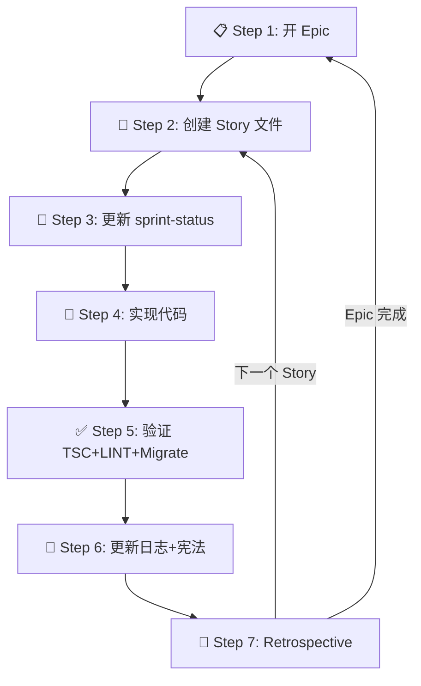

# BMAD 驱动开发流程规范

> 基于 Thoughtmark MVP 开发实战经验总结，适用于 AI 辅助开发场景。

## 核心理念

**BMAD = Build Measure Adjust Deliver**

- 所有开发活动以 **BMAD 产出物** 为中心管理
- 文档是**一等公民**，与代码同等重要
- **边做边记**，而非完成后补写

---

## 目录结构约定

```
project/
├── _bmad/bmm/                    ← BMAD 框架核心（不可修改）
│   ├── agents/                   ← 角色定义
│   ├── workflows/                ← 内置工作流（SKILL.md + workflow.md）
│   └── config.yaml               ← 项目配置
├── _bmad-output/                 ← BMAD 产出物（本项目生成）
│   ├── planning-artifacts/       ← 规划阶段产出
│   │   ├── prd.md                ← 产品需求文档
│   │   ├── architecture.md       ← 系统架构
│   │   ├── epics.md              ← Epic 路线图 + 详细 Stories
│   │   └── ux-design-*.md/html   ← UX 设计文档
│   └── implementation-artifacts/ ← 实现阶段产出
│       ├── sprint-status.yaml    ← Sprint 状态追踪（唯一真相源）
│       └── {epic}-{story}-*.md   ← Story 实现详情
├── project-context.md            ← 项目宪法（技术栈/约定/API）
└── docs/dev-history/             ← 开发历史归档
    ├── 开发执行日志.md            ← 全景纪实入口
    ├── AI执行复盘与教训.md         ← 教训库
    └── MVP_Retrospective.md      ← 回顾文档
```

---

## 开发生命周期（7 步强制检查点）



### Step 1: 开 Epic — 阅读 AC

**触发**: 开始新 Epic 时
**强制动作**:
1. 阅读 `_bmad-output/planning-artifacts/epics.md` 中对应 Epic 的所有 Story + Acceptance Criteria
2. 阅读 `docs/dev-history/AI执行复盘与教训.md`（如存在）
3. 更新 `sprint-status.yaml`: `epic-X: in-progress`

### Step 2: 创建 Story 文件 ⚠️ 强制

**触发**: 每个 Story 开始前
**强制动作**:
1. 在 `_bmad-output/implementation-artifacts/` 下创建 `{epic}-{story}-*.md`
2. 文件内容至少包含：
   - Story 标题 + 描述
   - Acceptance Criteria（从 epics.md 复制）
   - 技术方案要点
3. 更新 `sprint-status.yaml`: `X-Y-story-name: in-progress`

**反面教训**: Thoughtmark MVP 中 Epic 2 和 Epic 5 跳过了此步骤，导致后期无法追溯设计决策。

### Step 3: 更新 sprint-status.yaml ⚠️ 每次状态变更

**规则**: Story 状态变更时**立即更新**，不得批量刷

```yaml
# 正确 ✅ —— 实时更新
3-1-plugin-popup-bookmark: in-progress  # 开始开发时标记

# 错误 ❌ —— 批量刷
3-1: done  # 5 个 Story 同时标完
3-2: done
3-3: done
```

### Step 4: 实现代码

**规则**:
1. 遵循 `project-context.md` 中的命名约定和 API 格式
2. **引入新依赖前必须暂停**，向用户说明 Why & What
3. 代码注释覆盖率 ≥ 关键函数的 JSDoc + 文件头注释

### Step 5: 验证 — TSC + LINT + Migrate ⚠️ 强制

**触发**: 每次 Story 代码完成后
**强制动作**:
```bash
npx tsc --noEmit         # TypeScript 类型检查
npm run lint             # ESLint 规范检查
npx prisma migrate dev   # 数据库迁移（如有 schema 变更）
```
**规则**: 3 项全过才能 `git commit`，0 容忍编译错误进 Git。

### Step 6: 更新日志 + 宪法 ⚠️ 强制

**触发**: 每个 Story 完成后立即执行

| 更新什么 | 何时更新 |
|---|---|
| `开发执行日志.md` | **每个 Story 完成后**追加产出表+验证结果+踩坑 |
| `project-context.md` | **引入新技术栈/API/环境变量时**同步更新 |
| `sprint-status.yaml` | 标记 `X-Y: done` |

**反面教训**: Thoughtmark MVP 中 Epic 2/5/6 在全部完成后才补写日志，丢失了过程细节。

### Step 7: Epic Retrospective ⚠️ 强制

**触发**: Epic 全部 Stories 完成后
**强制动作**:
1. 在 `docs/dev-history/` 中追加 Retro 章节
2. 必须包含 **3 条**：
   - 💚 做好了什么
   - 🔴 踩坑了什么
   - 🔵 下次改进什么
3. 更新 `sprint-status.yaml`: `epic-X-retrospective: done`

---

## 快速参考卡

| 阶段 | 强制产物 | 位置 |
|---|---|---|
| Epic 开始 | sprint-status 标 in-progress | `sprint-status.yaml` |
| Story 开始 | Story 文件 + sprint-status | `implementation-artifacts/` |
| 代码完成 | TSC ✅ LINT ✅ Migrate ✅ | 终端 |
| Story 完成 | 日志追加 + sprint-status 标 done | `开发执行日志.md` |
| 新技术栈 | project-context 同步更新 | `project-context.md` |
| 新依赖 | 暂停审批 | 向用户确认 |
| Epic 完成 | Retrospective | `docs/dev-history/` |

---

## 违规等级

| 等级 | 场景 | 后果 |
|---|---|---|
| 🔴 P0 | TSC/LINT 未通过就 commit | 必须 amend 或 revert |
| 🟡 P1 | 跳过 Story 文件创建 | 必须补创建后才能继续 |
| 🟡 P1 | project-context 未同步更新 | 当前 Story 完成前补更新 |
| 🟢 P2 | 日志延迟追加 | 当前 Epic 结束前补写 |
